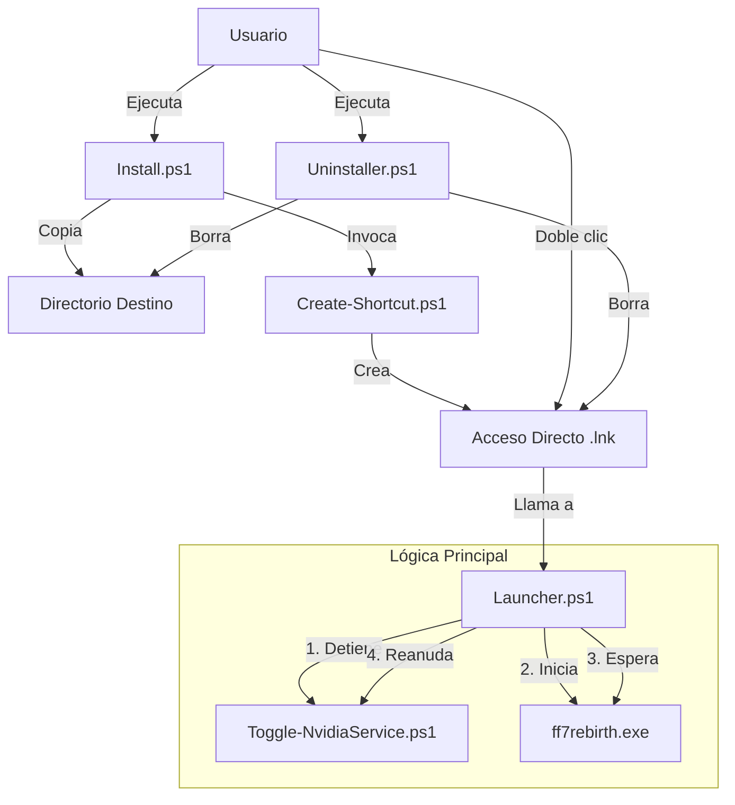

# Arquitectura del Sistema

Este documento describe la arquitectura técnica, las dependencias de los componentes y las decisiones de diseño del proyecto **FFVIIRB-Nvidia-FrameView-Toggle**.

## 1. Visión General

El proyecto es un conjunto de scripts en PowerShell diseñados para automatizar la resolución del conflicto de interfaz en Final Fantasy VII Rebirth. La herramienta suspende el servicio `FvSvc` (Nvidia FrameView Service) antes de iniciar el juego y lo reanuda automáticamente tras su cierre.

La arquitectura sigue un enfoque puramente imperativo basado en scripts individuales ("Standalone") y constantes integradas (hardcoded) para maximizar el rendimiento y la robustez.

## 2. Diagrama de Dependencias

A continuación, se muestra el flujo de dependencias y ejecución entre los diferentes scripts:

## 3. Descripción de Componentes

### 3.1. Install.ps1
- **Rol:** Script de despliegue ("Deployment").
- **Dependencias:** `Create-Shortcut.ps1`, `Launcher.ps1`, `Toggle-NvidiaService.ps1`, `Uninstaller.ps1`.
- **Detalles técnicos:** 
  - Genera la carpeta de instalación en la ruta de guardado del juego (`Documents\My Games\FINAL FANTASY VII REBIRTH`).
  - Copia los recursos de ejecución (`src/`) al destino.
  - Invoca internamente a `Create-Shortcut.ps1` usando el operador de llamada `&` para delegar la creación del acceso directo.

### 3.2. Create-Shortcut.ps1
- **Rol:** Utilidad.
- **Dependencias:** Ninguna externa en tiempo de ejecución.
- **Detalles técnicos:**
  - Instancia el objeto COM `WScript.Shell` para interactuar con la shell de Windows.
  - El acceso directo invoca `powershell.exe` con los modificadores `-WindowStyle Hidden` (para invisibilidad) y `-ExecutionPolicy Bypass`.
  - Contiene variables estáticas para la ruta del icono (el ejecutable del juego en Steam).

### 3.3. Launcher.ps1
- **Rol:** Controlador Principal ("Main Controller").
- **Dependencias:** `Toggle-NvidiaService.ps1`.
- **Detalles técnicos:**
  - Implementa un patrón de Auto-Elevación. Si no posee privilegios de Administrador, relanza el proceso PowerShell solicitando UAC (`-Verb RunAs`).
  - Delega el control de estado de Windows (`Stop-Service`/`Start-Service`) completamente al script de toggle.
  - Incluye bucles de sondeo (`Get-Process` y `Wait-Process`) para determinar el ciclo de vida del proceso del juego.

### 3.4. Toggle-NvidiaService.ps1
- **Rol:** Acción Atómica / Servicio.
- **Dependencias:** Ninguna (Windows API).
- **Detalles técnicos:**
  - Capaz de operar de forma "Standalone" (ejecución directa por el usuario) o como subrutina.
  - Admite el parámetro `-NoWait` para desactivar las pausas artificiales de lectura (necesario cuando es consumido de forma silenciosa por `Launcher.ps1`).

### 3.5. Uninstaller.ps1
- **Rol:** Limpieza ("Garbage Collection" manual).
- **Dependencias:** Ninguna.
- **Detalles técnicos:**
  - Reemplaza de forma segura la eliminación manual, borrando el acceso directo en `[Environment]::GetFolderPath('Desktop')` y purgando la carpeta del proyecto.

## 4. Decisiones Arquitectónicas (ADR)

### ADR 1: Uso de Constantes en lugar de Configuración Dinámica
- **Contexto:** Inicialmente el proyecto contaba con un archivo `config.json` que era leído en disco por `Launcher.ps1` para resolver dinámicamente nombres de proceso y rutas.
- **Decisión:** Se eliminó la dependencia de `config.json` e inyectó su contenido en forma de variables constantes en la cabecera de los scripts afectados.
- **Consecuencias:** 
  - Mayor velocidad de ejecución.
  - Reducción en los vectores de fallo (errores de IO, JSON mal formado).
  - Simplicidad arquitectónica.

### ADR 2: Delegación del Toggle
- **Contexto:** `Launcher.ps1` implementaba lógicamente las órdenes de Windows Management Instrumentation (WMI) o Cmdlets (`Stop-Service`/`Start-Service`).
- **Decisión:** Extraer esta lógica a un script atómico (`Toggle-NvidiaService.ps1`) y llamarlo desde el launcher.
- **Consecuencias:**
  - Separación de responsabilidades o *Separation of Concerns (SoC)* cumplida.
  - El usuario puede usar la herramienta exclusivamente para detener/reanudar la telemetría, sin depender del launcher del juego.

### ADR 3: Estructura de Documentación
- **Contexto:** El proyecto requiere una base documental mantenible.
- **Decisión:** Estructurar la documentación en directorios específicos, acatando los estándares del equipo (`docs/Architecture/`, `docs/QA/`, `docs/DevGuide/`, `docs/API/`).
